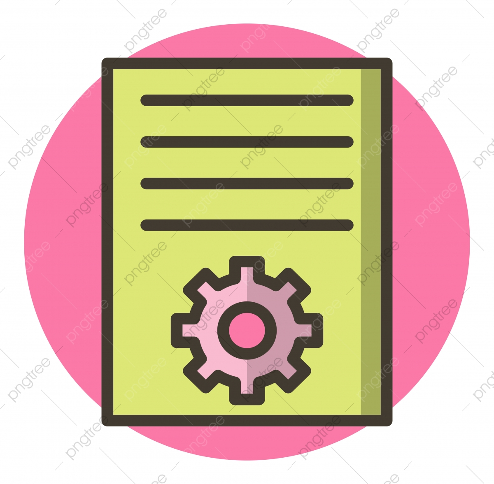

# article-task
<div id="top"></div>

[![Forks][forks-shield]][forks-url]
[![Stargazers][stars-shield]][stars-url]
[![Issues][issues-shield]][issues-url]
[![MIT License][license-shield]][license-url]
[![LinkedIn][linkedin-shield]][linkedin-url]


<!-- PROJECT LOGO -->
<br />
<div align="center">

  <a href="https://github.com/GrigoriGrigoryan/article-task">
    
  </a>

<h3 align="center">Article Task</h3>

  <p align="center">
    Read README to jumpstart project!
    <br />
    <a href="https://github.com/GrigoriGrigoryan/article-task"><strong>Explore the docs »</strong></a>
    <br />
    <br />
    <a href="https://github.com/GrigoriGrigoryan/article-task">View Demo</a>
    ·
    <a href="https://github.com/GrigoriGrigoryan/article-task/issues">Report Bug</a>
    ·
    <a href="https://github.com/GrigoriGrigoryan/article-task/issues">Request Feature</a>
  </p>
</div>


<!-- TABLE OF CONTENTS -->
<details>
  <summary>Table of Contents</summary>
  <ol>
    <li>
      <a href="#about-the-project">About The Project</a>
      <ul>
        <li><a href="#built-with">Built With</a></li>
      </ul>
    </li>
    <li>
      <a href="#getting-started">Getting Started</a>
      <ul>
        <li><a href="#prerequisites">Prerequisites</a></li>
        <li><a href="#installation">Installation</a></li>
      </ul>
    </li>
    <li><a href="#usage">Usage</a></li>
    <li><a href="#roadmap">Roadmap</a></li>
    <li><a href="#contributing">Contributing</a></li>
    <li><a href="#license">License</a></li>
    <li><a href="#contact">Contact</a></li>
    <li><a href="#acknowledgments">Acknowledgments</a></li>
  </ol>
</details>


<!-- ABOUT THE PROJECT -->
## About The Project

Here's why:
* Your time should be focused on creating something amazing. A project that solves a problem and helps others

* You shouldn't be doing the same tasks over and over

* You should implement DRY principles to the rest of your life :smile:


I'll be adding more functionality in the near future. You may also suggest changes by forking this repo and creating a pull request or opening an issue.


<p align="right">(<a href="#top">back to top</a>)</p>


### Built With

This section should list any major frameworks/libraries used to bootstrap my project.

* [Node.js](https://nodejs.org/)
* [Express.js](https://expressjs.com/)
* [PostgreSQL](https://www.postgresql.org/)
* [Typescript](https://www.typescriptlang.org/)
* [JavaScript](https://www.javascript.com/)
* [Docker](https://www.docker.com/)
* [Postman](https://www.postman.com/)
* [React](https://reactjs.org/)
* [HTML/CSS]()

<p align="right">(<a href="#top">back to top</a>)</p>


<!-- GETTING STARTED -->
## Getting Started

This is an example of how you may set up your project locally.
To get a local copy up and running follow these simple example steps.


### Installation

1. Clone the repo
   ```sh
   git clone https://github.com/your_username_/Project-Name.git
   ```
2. Install NPM packages
   ```sh
   npm install
   ```
4. Create and enter your keys in `.env`
   ```
    PORT=5444
    POSTGRES_PORT=5432
    POSTGRES_USER=postgres
    POSTGRES_PASSWORD=postgres
    POSTGRES_DB=pg_data
    POSTGRES_HOST=db

   ```

<p align="right">(<a href="#top">back to top</a>)</p>


<!-- USAGE EXAMPLES -->
## Usage

To Run project run command

   ```sh
   docker-compose up 
   ```
Then open another terminal and open clinet folder and run
   ```sh
   npm start
   ```
For migration part open second terminal and run command
   ```sh
   docker exec -it greenteam-web-1 bash 
   ```

After entering docker terminal run command

   ```sh
    npm run typeorm:migration:generate -- init1
   ```

<p align="right">(<a href="#top">back to top</a>)</p>


<!-- ROADMAP -->
## Roadmap

- [x] Add Article
- [x] Edit Article
- [x] Add Migrations
    - [x] English
    - [ ] Russian

<p align="right">(<a href="#top">back to top</a>)</p>


<!-- CONTRIBUTING -->
## Contributing

Contributions are what make the open source community such an amazing place to learn, inspire, and create. Any contributions you make are **greatly appreciated**.

If you have a suggestion that would make this better, please fork the repo and create a pull request. You can also simply open an issue with the tag "enhancement".


1. Fork the Project
2. Create your Feature Branch (`git checkout -b feature/AmazingFeature`)
3. Commit your Changes (`git commit -m 'Add some AmazingFeature'`)
4. Push to the Branch (`git push origin feature/AmazingFeature`)
5. Open a Pull Request

<p align="right">(<a href="#top">back to top</a>)</p>


<!-- LICENSE -->
## License

Distributed under the MIT License. See `LICENSE.txt` for more information.

<p align="right">(<a href="#top">back to top</a>)</p>


<!-- CONTACT -->
## Contact

Grigori - [LinkedIn](https://www.linkedin.com/in/grigori-g-2b7247207/) - grigorigrigoryan8@gmail.com

Project Link: [https://github.com/GrigoriGrigoryan/article-task](https://github.com/GrigoriGrigoryan/article-task)

<p align="right">(<a href="#top">back to top</a>)</p>


<p align="right">(<a href="#top">back to top</a>)</p>


[forks-shield]: https://github.com/GrigoriGrigoryan/article-task.svg?style=for-the-badge
[forks-url]: https://github.com/GrigoriGrigoryan/article-task/network/members
[stars-shield]: https://github.com/GrigoriGrigoryan/article-task.svg?style=for-the-badge
[stars-url]: https://github.com/GrigoriGrigoryan/article-task/stargazers
[issues-shield]: https://github.com/GrigoriGrigoryan/article-task.svg?style=for-the-badge
[issues-url]: https://github.com/GrigoriGrigoryan/article-task/issues
[license-shield]: https://github.com/GrigoriGrigoryan/article-task.svg?style=for-the-badge
[license-url]: https://github.com/GrigoriGrigoryan/article-task/blob/master/LICENSE.txt
[linkedin-shield]: https://img.shields.io/badge/-LinkedIn-black.svg?style=for-the-badge&logo=linkedin&colorB=555
[linkedin-url]: https://www.linkedin.com/in/grigori-g-2b7247207/

